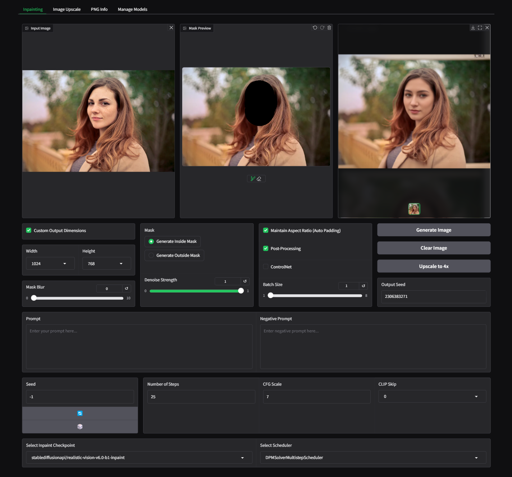

# Installation

Create and activate a virtual environment:

python -m venv myenv

source myenv/bin/activate  # On Linux/macOS

myenv\Scripts\activate     # On Windows

# Install dependencies

pip install -r requirements.txt

Here's a way to group the first two lines together under the "Inpainting" tab while keeping the other tabs separate. This makes it clear that both inpainting and mask creation are related to the inpainting tab.

```markdown
# Features

- Inpainting tab: This tab allows image inpainting with the parameters detailed in
<<<<<<< HEAD
 [StableDiffusionInpaintPipeline](https://huggingface.co/docs/diffusers/en/api/pipelines/stable_diffusion/inpaint)
 
 Additional features: A manual brush tool for creating the image mask,  a Gaussian blur slider for masked region,
 post-processing button to preserve non-masked areas.

- Image Upscale tab: Includes ESRGAN upscaling options.

- PNG Info tab: For previously generated images, featuring a view of the generation
 parameters and a "Send Parameters to Inpaint Tab" option.
```

# Images

