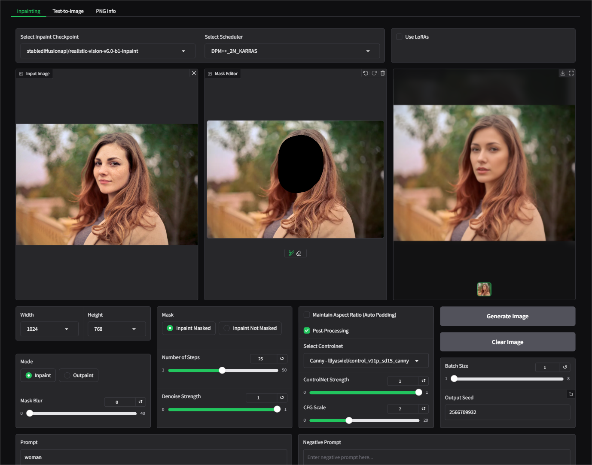

# Installation

Create and activate a virtual environment:
```markdown
python -m venv myenv

source myenv/bin/activate  # On Linux/macOS

myenv\Scripts\activate     # On Windows
```

Clone the repository:
```markdown
git clone https://github.com/AbrahamPaulJ/diffusers-webui.git

cd diffusers-webui
```

# Install dependencies

```markdown
pip install -r requirements.txt
```

# Run

```markdown
python app.py
```

# Features

- [NEW]: SDXL support.

- Image To Image tab: Allows image-to-image, inpainting and outpainting with the APIs:
[StableDiffusionInpaintPipeline](https://huggingface.co/docs/diffusers/en/api/pipelines/stable_diffusion/img2img)
and [StableDiffusionInpaintPipeline](https://huggingface.co/docs/diffusers/en/api/pipelines/stable_diffusion/inpaint)

    - Implemented features:

        - ControlNet support: Canny, Depth and Openpose.

        - Support for multiple LoRA and embedding files (textual inversion).

        - Inpaint Mode:

            - Manual Brush Tool: Allows users to create a image mask (inpaint mode).
            
            - Gaussian Blur Slider: For applying blur to the mask edges.
            
            - Post-Processing Option: Retains original non-masked areas after image generation. 
        

        - Outpaint Mode: Outpainting is done using the inpaint pipeline, where the a black background canvas is used as a mask.       
              
            - The transform tool allows cropping of the image placed on the black canvas, 
            which makes outpainting in any direction easy.

            - You can choose where to place the image on the canvas using the 
            "Image Positioned at:" option.

            - You can control output image size by adjusting the "Maximum Width/Height" parameter.
        

- Text to Image tab: Generates images from prompts using the API:
[StableDiffusionPipeline](https://huggingface.co/docs/diffusers/en/api/pipelines/stable_diffusion/text2img).

    - Implemented features:

        - Hi-Res .fix - 2x latent

        - Support for multiple LoRA and embedding files (textual inversion).

<!-- - Image Upscale tab: Includes ESRGAN upscaling options. -->

- PNG Info tab: For previously generated images, featuring a view of the generation
 parameters and options to send the parameters to other tabs.

# Images





# Notes

- Prompt format: To add prompt weighting, please use [Compel Prompt Syntax](https://github.com/damian0815/compel/blob/main/Reference.md)

- Ensure you have the correct version of Pytorch and CUDA supported by your device, this is necessary for enabling GPU for inference.

- To increase generation speed with GPU, you can install xformers if it is supported. It will be detected automatically once installed.

# Known Issues

- Image To Image Tab: Controlnet may not work with SDXL.
  
- Text To Image Tab:  Control image upload bug.
  
