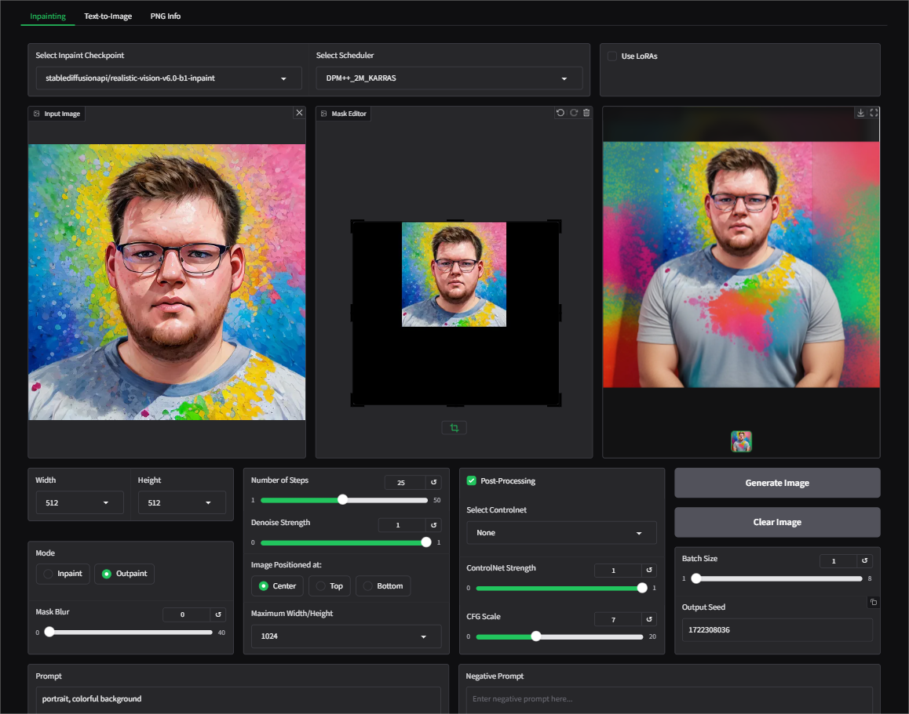

# Installation

Create and activate a virtual environment:
```markdown
python -m venv myenv

source myenv/bin/activate  # On Linux/macOS

myenv\Scripts\activate     # On Windows
```

Clone the repository:
```markdown
git clone https://github.com/AbrahamPaulJ/diffusers-webui.git

cd diffusers-webui
```

# Install dependencies

```markdown
pip install -r requirements.txt
```

# Run

```markdown
python app.py
```

# Features

- Inpainting tab: This tab allows image inpainting and outpaintin with the parameters detailed in 
[StableDiffusionInpaintPipeline](https://huggingface.co/docs/diffusers/en/api/pipelines/stable_diffusion/inpaint).

    - Implemented features:

        - Manual Brush Tool: Allows users to create the image mask (inpaint mode).
        
        - Transform Tool: Enables cropping of the outpaint canvas (outpaint mode).
        
        - Gaussian Blur Slider: For applying blur to the mask edges.
        
        - Post-Processing Option: Preserves non-masked areas during processing.

- Image Upscale tab: Includes ESRGAN upscaling options.

- PNG Info tab: For previously generated images, featuring a view of the generation
 parameters and a "Send Parameters to Inpaint Tab" option.

# Images




<!-- # Notes

- To use the Upscale tab, you may need to download 'RealESRGAN_x4.pth' manually and place it in the models folder. -->
